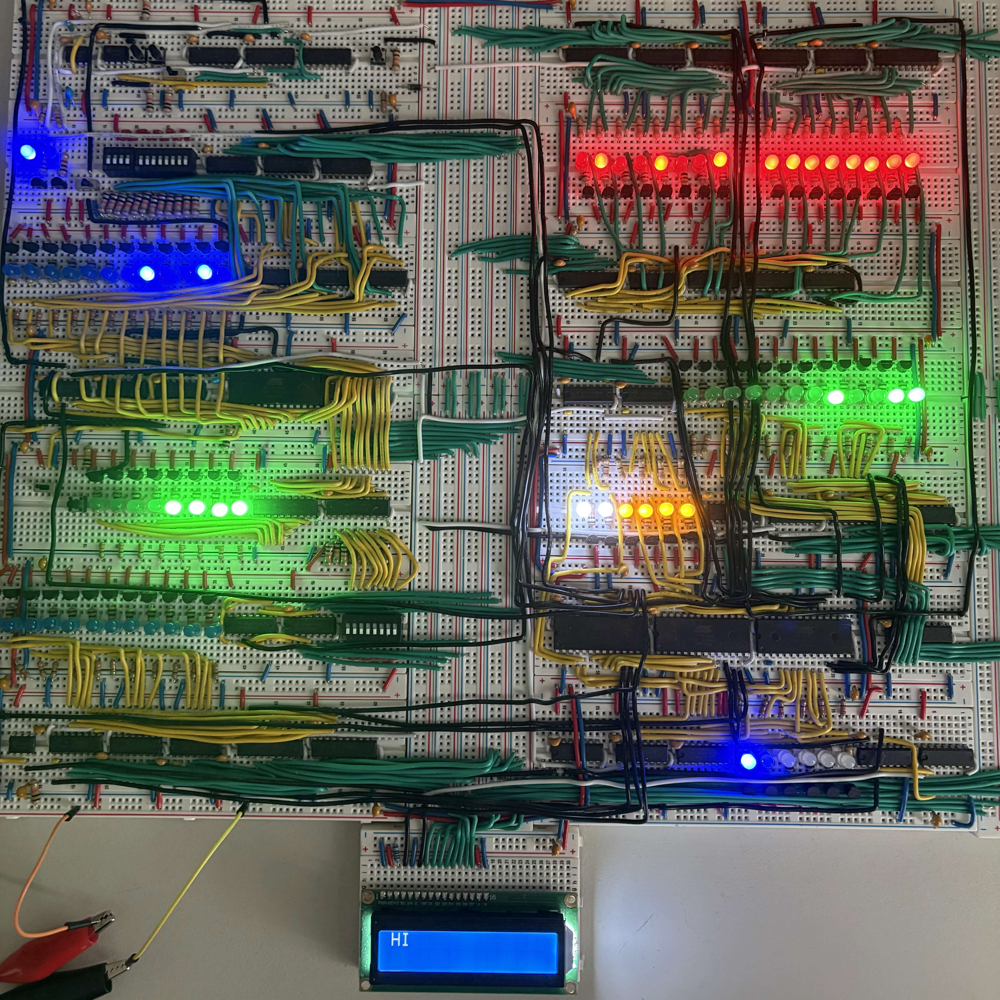

# MISC8: Minimum Instruction Set Computer

This project currently includes an emulator and assembler for my homebrew breadboard computer.

There will eventually be a compiler, for now an assembler is provided.

I also plan to extend the emulator by adding an emulator for the 1602A LCD, this way `dwritei` and `dwrited` can be debugged.

## About the MISC8

The computer is based on Ben Eater's own homebrew. However, mine has a few improvements.

> 285kHz Clock Speed \
> 12-bit addresses \
> 4 KiB of programmable ROM \
> 2 programs (each 4 KiB) \
> 2 general purpose 8-bit registers \
> 1 address register \
> 16 instructions \
> 1602A LCD

More information can be found in `./docs`.

## Compiling

For a quick compile-all: run `make` and all binaries will be placed in `./bin`

If you want to only compile the emulator, `make emulator` will do the trick.

## Usage

### Assembler

The assembler takes two arguments: the input assembly file and the output binary file (program file).

The input file is a required argument. Omitting the output argument will write the binary to `./program.bin`.

I recommend looking at the `./examples/` to get an idea on how to create programs. There's also `./docs` you can read which will help as well.

You can pass an assembly file to the MISC8 assembler by using the `-i` flag.

> Example: \
> `misc8_assembler -i./program.asm -o./program.bin`

Or if you're using `make`

> Example: \
> `make run-emulator "ARGS=-i./program.asm -o./program.bin`

### Emulator

The emulator takes one argument: the program file.

The program file is where you write the MISC8 program to. It should be a binary file, not a text one. I don't recommend writing them directly, use the assembler.

You can pass a program file to the MISC8 emulator by using the `-i` flag.

> Example: \
> `misc8_emulator -i./program.bin`

Or if you're using `make`

> Example: \
> `make run-emulator "ARGS=-i./program.bin`

## Examples

I try to demonstrate every feature of the MISC8 and its associated programs. I add these examples to `./examples`.

Feel free to examples of your own and contribute them back, I love seeing what other people make!

## Going Forward

As stated before, I plan on writing a compiler for my computer. However, this project was slightly rushed and the code-quality isn't up to my standards. Therefore, I'll be re-writing the programs at at later date.

I also plan on adding extensive documentation to `./docs` in the near future. Starting with how to program for the assembler.